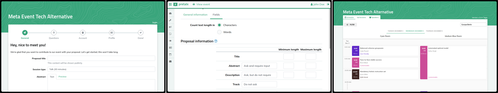

|logo|

``eventyay-talk`` is a comprehensive conference planning tool designed to deliver an exceptional experience for organizers, speakers, reviewers, and attendees. It efficiently manages the submission process with a customizable Call for Participation, facilitates the review and selection of submissions, and handles scheduling and release logistics. Post-event, ``eventyay-talk`` enables speakers to receive feedback, upload their slides, and allows organizers to embed recordings.

For a detailed overview of its capabilities, check out our feature list on our main site. ``eventyay-talk`` typically covers all the essential tasks required to curate submissions and content for a multi-track, multi-day conference.

You can host eventyay-talk yourself, or use our public instance at `eventyay.com`.

|screenshots|

``eventyay-talk`` is highly customizable, allowing you to modify its appearance and behavior to suit your event's needs. If the default settings don't meet your requirements, you can also create your own plugins for additional functionality.

Project status
-----------------

`eventyay-talk` is under active development and used by many events. It supports everything required for talk submission, speaker communication, and scheduling. The project is based on pretalx.

Contributing
---------------

Please check out our issues and start contributing.

License
------------
We publish `eventyay-talk` under the terms of the Apache 2 License. See the LICENSE file for further information and the complete license text

.. _issues: https://github.com/fossasia/eventyay-talk/issues/
